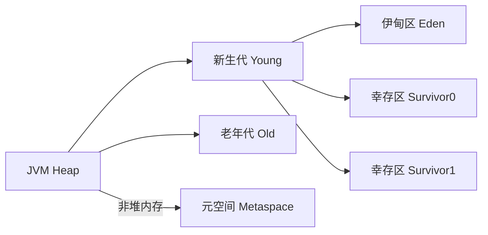

## 常用命令

### jps

查看当前启动的java程序

```sh
# 输出主类完整包名
jps -l 

# 输出传递JVM参数
jps -v
```


### jmap

查看内存信息、类实例统计

⚠️ **警告**：`-histo:live`会触发 **Stop-The-World Full GC**！生产环境谨慎使用！

```sh
#统计全部对象
jmap -histo <pid>           
jmap -histo 25992 >  ./log.txt #结果输出到指定文件


# 只统计存活对象（会触发 Full GC！）
jmap -histo:live <pid>     
```


### jstack

查看程序线程情况

```sh
# 指定进程查询
jstack <pid>
```


### jstat


查看GC情况

```sh
jstat -gc <pid>
```


- S0C：第一个幸存区大小，单位kb
- S1C：第二个幸存区大小
- S0U：第一个幸存区使用大小
- S1U：第二个幸存区使用大小
- EC  ：伊甸园区大小
- EU  ：伊甸园区使用大小
- OC ：老年代大小
- OU ：老年代使用大小
- MC ：方法区大小
- MU ：方法区使用大小
- CCSC：压缩类空间大小
- CCSU：压缩类空间使用大小
- YGC：年轻代垃圾回收次数
- YGCT：年轻代垃圾回收消耗时间，单位S
- FGC：老年代垃圾回收次数
- FGCT：老年代垃圾回收消耗时间，单位S
- GCT：垃圾回收总消耗时间，单位S


查看堆内存情况

```sh
jstat -gccapacity <pid>

# 查询指定进程新生代和老年代大小
jstat -gccapacity 72755 | awk '{print "新生代:", $3/1024"MB", "老年代:", $9/1024"MB"}'
```


|   列名    |            全称             | 单位 |                             说明                             |
| :-------: | :-------------------------: | :--: | :----------------------------------------------------------: |
| **NGCMN** | New Generation Capacity Min |  KB  |           **新生代最小容量**（`-Xmn`或默认初始值）           |
| **NGCMX** | New Generation Capacity Max |  KB  |        **新生代最大容量**（受 `-Xmx`和 GC 策略影响）         |
|  **NGC**  |   New Generation Capacity   |  KB  |           **当前新生代容量**（运行时可能动态调整）           |
|  **S0C**  |     Survivor 0 Capacity     |  KB  |                   **幸存区 0 区当前容量**                    |
|  **S1C**  |     Survivor 1 Capacity     |  KB  |                   **幸存区 1 区当前容量**                    |
|  **EC**   |        Eden Capacity        |  KB  |                     **伊甸园区当前容量**                     |
| **OGCMN** | Old Generation Capacity Min |  KB  |                 **老年代最小容量**（初始值）                 |
| **OGCMX** | Old Generation Capacity Max |  KB  |          **老年代最大容量**（`-Xmx`减去新生代大小）          |
|  **OGC**  |   Old Generation Capacity   |  KB  |                      **当前老年代容量**                      |
|  **OC**   |        Old Capacity         |  KB  |       **老年代当前容量**（与 `OGC`相同，历史遗留字段）       |
| **MCMN**  |   Metaspace Capacity Min    |  KB  |      **元空间最小容量**（`-XX:MetaspaceSize`，JDK 8+）       |
| **MCMX**  |   Metaspace Capacity Max    |  KB  |   **元空间最大容量**（`-XX:MaxMetaspaceSize`，默认无限制）   |
|  **MC**   |     Metaspace Capacity      |  KB  |                      **当前元空间容量**                      |
| **CCSMN** | Compressed Class Space Min  |  KB  | **压缩类空间最小容量**（`-XX:CompressedClassSpaceSize`，JDK 8+） |
| **CCSMX** | Compressed Class Space Max  |  KB  |                    **压缩类空间最大容量**                    |
| **CCSC**  |   Compressed Class Space    |  KB  |         **当前压缩类空间容量**（启用指针压缩时有效）         |
|  **YGC**  |  Young Generation GC Count  |  次  |                    **年轻代 GC 发生次数**                    |
|  **FGC**  |        Full GC Count        |  次  |                    **老年代 GC 发生次数**                    |


## 堆内存结构




- **新生代 (Young Generation)**：存放**新创建的对象**（生命周期短）
  - **Eden区**：对象诞生的地方（占新生代80%）
  - **Survivor区 (S0/S1)**：存放Minor GC后存活的对象（各占10%）
- **老年代 (Old Generation)**：存放**长期存活的对象**（如缓存、全局配置）
- **元空间 (Metaspace)**：存放**类元数据**（JDK8+替代永久代）


